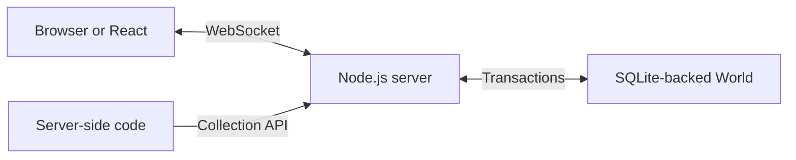

<div align="center">

# Spacewave

**Live data for TypeScript applications.**

[](https://www.npmjs.com/package/spacewave)
[](#getting-started)
[](LICENSE)

[Get started](#getting-started) · [Showcase](#showcase) · [API reference](API.md) · [Task board](examples/task-board) · [Contributing](#contributing)

</div>

Spacewave keeps application data in sync between a Node.js server and TypeScript clients. Define your data with a shared schema, read and write typed collections, and subscribe to changes from the browser or React.

Build shared task boards, chat feeds, job dashboards, and settings that follow users between tabs. Accepted writes persist in SQLite, mutations run in transactions, and your authentication and authorization functions control access. You run the server and keep the data in your own application.

```sh
npm install spacewave
```

## Showcase

These examples share a schema and a connected client named `db`. Server examples use `server`, created with that same schema. The [setup below](#getting-started) defines their collections and connects them.

### Shared task lists

Write a task in one tab and watch it appear in another. Collection names and record values are checked by TypeScript.

```ts
const todos = db.collection('todos')

const unsubscribe = todos.subscribe(
  {},
  {
    next: ({ status, data }) => console.log(status, data),
  },
)

await todos.put('welcome', { title: 'Try Spacewave', done: false })
await todos.put('welcome', { title: 'Try Spacewave', done: true })
```

Subscriptions deliver complete snapshots ordered by key. Call `unsubscribe()` when the view leaves; the client handles reconnection.

### Chat feeds

Use a key prefix to subscribe to one room's messages. Timestamp-prefixed keys keep the feed in key order; a UUID distinguishes messages sent at the same time.

```ts
const messages = db.collection('messages')
const room = 'general/'

const unsubscribe = messages.subscribe(
  { prefix: room },
  {
    next: ({ data }) => console.table(data.map(({ value }) => value)),
  },
)

await messages.put(
  `${room}${new Date().toISOString()}/${crypto.randomUUID()}`,
  {
    text: 'Anyone up for a quick demo?',
  },
)
```

Messages persist across server restarts. A prefix selects the feed; collection permissions and the authenticated scope control access. This example orders messages by client timestamp, not server arrival time.

### Background job progress

A worker can write through the same collection API that browsers use. Here a server-side job reports its progress after processing a batch:

```ts
const jobs = server
  .as({ subject: 'import-worker', scope: 'demo' })
  .collection('jobs')

await jobs.put('import/contacts', { completed: 50, total: 100 })
```

Subscribe from the dashboard to receive progress as it changes:

```ts
const unsubscribe = db.collection('jobs').subscribe(
  { prefix: 'import/' },
  {
    next: ({ data }) => console.table(data),
  },
)
```

`server.as(principal)` applies the same authorization policy as client operations. Grant the worker access to the collections its job needs.

### Shared settings

Keep a team's preferences in one record. Connected settings views can subscribe to changes; a one-time read uses `get()`.

```ts
const settings = db.collection('settings')

await settings.put('appearance', { theme: 'dark', compact: true })
const appearance = await settings.get('appearance')
console.log(appearance?.theme) // 'dark'
```

### Separate team datasets

Each authenticated scope has its own collection data. The same record key can hold different values for different teams:

```ts
const teamA = server.as({ subject: 'service', scope: 'team-a' })
const teamB = server.as({ subject: 'service', scope: 'team-b' })

await teamA
  .collection('todos')
  .put('welcome', { title: 'Plan the launch', done: false })
await teamB
  .collection('todos')
  .put('welcome', { title: 'Review the design', done: false })
```

Your server's verifier assigns the caller's scope, and its policy grants access. The setup below permits the example scopes; use your application's token verification and team membership rules before serving users.

### Atomic counters

When a change depends on existing data, use a named mutation. Its reads and writes run in one server transaction. Add this handler to the server's `mutations` option:

```ts
import type { MutationHandlers, Principal } from 'spacewave'

const mutations: MutationHandlers<typeof schema, Principal> = {
  increment: async (context, { key }) => {
    const counters = context.collection('counters')
    const value = ((await counters.get(key)) ?? 0) + 1
    await counters.put(key, value)
    return value
  },
}
```

Then call it from a client:

```ts
const views = await db.mutate('increment', { key: 'page-views' })
```

The schema declares the input and output types. A mutation can also update several records or collections in the same transaction.

### Live React views

The optional React entry binds hooks to your schema. Pass an existing connection to the provider and read live collections inside it:

```tsx
import { createSyncContext } from 'spacewave/react'

const { SyncProvider, useCollection } = createSyncContext(schema)

function Tasks() {
  const todos = useCollection('todos')
  if (todos.status === 'loading') return <p>Loading tasks…</p>
  if (todos.status === 'error')
    return <p role="alert">{todos.error?.message}</p>

  return (
    <>
      {todos.status === 'stale' && (
        <p>Reconnecting. Showing the last saved view.</p>
      )}
      <ul>
        {todos.data.map(({ key, value }) => (
          <li key={key}>{value.title}</li>
        ))}
      </ul>
    </>
  )
}

export function App() {
  return (
    <SyncProvider db={db}>
      <Tasks />
    </SyncProvider>
  )
}
```

`useCollection` cleans up with the component. `useDatabase` gives components the same typed database for writes. The application owns and closes the connection. See the [React task board](examples/task-board/react.tsx) for forms, connection feedback, and write recovery.

### Retry without repeating a change

A connection can fail after the server accepts a write but before the client receives its result. If the call reports `UNCERTAIN`, retry the exact operation with its original request ID and input:

```ts
import { SyncError } from 'spacewave'

const requestId = crypto.randomUUID()
const input = { key: 'page-views' }

try {
  await db.mutate('increment', input, { requestId })
} catch (error) {
  if (!(error instanceof SyncError) || error.code !== 'UNCERTAIN') throw error
  await db.mutate('increment', input, { requestId })
}
```

An accepted duplicate returns the original result, including after a server restart. Reusing the ID with different input fails with `CONFLICT`. The [retry reference](API.md#uncertain-writes) explains how to retain unresolved writes for later recovery.

## Motivation

Adding live data often means writing the same contract in several places: database models, API handlers, client types, subscription messages, and UI state. Every new feature has to keep those pieces in agreement.

Spacewave gives that work a shared starting point. Define collections and mutations once with [Standard Schema](https://standardschema.dev/) validators, such as Zod. The server validates writes, TypeScript infers the client API, and subscriptions deliver accepted state to each view. Your application chooses its authentication provider, access policy, and interface.

## Architecture



The Node server authenticates connections, selects each caller's scope, and checks collection permissions on operations and subscription deliveries. Accepted writes commit to a Spacewave World, the engine's durable dataset stored in SQLite. Each dataset directory permits one server writer.

Clients receive whole-collection or prefix snapshots with `loading`, `current`, `stale`, or `error` status. Reconnection refreshes subscriptions; durable write receipts support recovery when acceptance is uncertain.

The npm package includes its compiled engine, which runs in a dedicated Node worker. Installing it requires no Go toolchain or lifecycle scripts. See the [API reference](API.md) for the storage, access, and connection contracts.

## Getting started

Use **Node.js `>=24.15.0 <25`** for the server and **ESM** for your application. Browser clients use the native WebSocket API. The optional React bindings require React 19.2 or later within 19.x and its matching type packages.

For a complete application, install Spacewave and copy the bundled task board:

```sh
npm install spacewave
cp -R node_modules/spacewave/examples/task-board ./task-board
cd task-board
npm install
npm start
```

Open [the vanilla board](http://127.0.0.1:8787) and [the React board](http://127.0.0.1:8787/react). Add a task in one and complete it in the other. Restart the server to see the saved tasks from its `.data` directory.

For your own application, the following setup supports the showcase examples. Install Zod with `npm install zod`. Server TypeScript projects also need `@types/node` 24.x and `"node"` in `compilerOptions.types`.

<details>
<summary><strong>Shared schema, server, and client setup</strong></summary>

**`schema.ts`** defines the contract imported by both server and client:

```ts
import { defineSchema } from 'spacewave'
import { z } from 'zod'

export const schema = defineSchema({
  id: 'showcase',
  version: 1,
  collections: {
    todos: z.object({ title: z.string(), done: z.boolean() }),
    messages: z.object({ text: z.string() }),
    jobs: z.object({ completed: z.number(), total: z.number() }),
    settings: z.object({
      theme: z.enum(['light', 'dark']),
      compact: z.boolean(),
    }),
    counters: z.number().int(),
  },
  mutations: {
    increment: {
      input: z.object({ key: z.string() }),
      output: z.number().int(),
    },
  },
})
```

**`server.ts`** opens storage and a WebSocket endpoint. Place the `mutations` declaration from the atomic counter example in this module before `createServer`:

```ts
import { SyncError } from 'spacewave'
import { createServer } from 'spacewave/server'

import { schema } from './schema.js'

const server = await createServer({
  directory: './data',
  schema,
  authenticate: async (token) => {
    if (token !== 'local-demo')
      throw new SyncError('AUTHENTICATION', 'Sign in again')
    return { subject: 'demo-user', scope: 'demo' }
  },
  authorize: ({ scope }) => ['demo', 'team-a', 'team-b'].includes(scope),
  mutations,
})

await server.listen({
  port: 8787,
  allowedOrigins: ['http://localhost:5173', 'http://127.0.0.1:5173'],
})
```

Replace the local demo verifier and policy before serving other users. Set `allowedOrigins` to your frontend's origin and use `wss://` with HTTPS. You can also attach sync to an [existing HTTP server](API.md#hosting-and-lifetime).

**`db.ts`** opens the client connection:

```ts
import { connect } from 'spacewave'

import { schema } from './schema.js'

export const db = await connect({
  url: 'ws://127.0.0.1:8787/sync',
  schema,
  getAccessToken: () => 'local-demo',
})
```

Import `db` and `schema` into the client examples that use them. Compile with your application's TypeScript setup and run the server output with Node.js. Call `await db.close()` and `await server.close()` at their respective application shutdowns. Importing package entries is safe during server rendering; keep calls to `connect()` in client startup code.

</details>

Prereleases are available with `npm install spacewave@next`. To build a tarball yourself, follow the [repository setup](../../README.md), then run `bun run build:sync` and `bun run pack:sync` from the repository root.

## Current scope

The sync API is in early development and is intended for evaluating small live datasets:

- Queries return complete collection or prefix snapshots. Defaults cap them at 10,000 records and 8 MiB per snapshot, with 256 KiB per record.
- Clients retain their last snapshot in memory while reconnecting. Writes require the server; durable offline replicas, offline queues, and optimistic updates are outside this release.
- Access policies grant reads and writes per collection within a scope. Row-level authorization and SQL queries are outside this release.
- Schema changes require an explicit migration. Write receipts remain for the dataset lifetime.

Read the [measured workload results](API.md#limits-and-performance) before growing a dataset, and the [release notes](CHANGELOG.md) for current capabilities.

## Contributing

Bug reports, small reproductions, and feedback on the API are welcome in [GitHub issues](https://github.com/s4wave/spacewave/issues). Include your package and Node versions, the error code, and enough code to reproduce the behavior.

For code changes, follow the [repository setup](../../README.md). Run `bun run build:sync` to build the package. `bun run qualify:sync` checks an installed tarball, persistence, reconnection, and the Chromium and WebKit examples. The [agent guide](AGENTS.md) covers integration rules for coding assistants.

## License

[Apache-2.0](LICENSE). Distributed packages include third-party notices in `dist/THIRD_PARTY_NOTICES.txt`.
